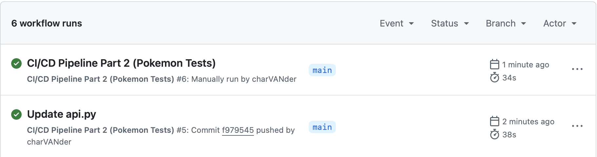
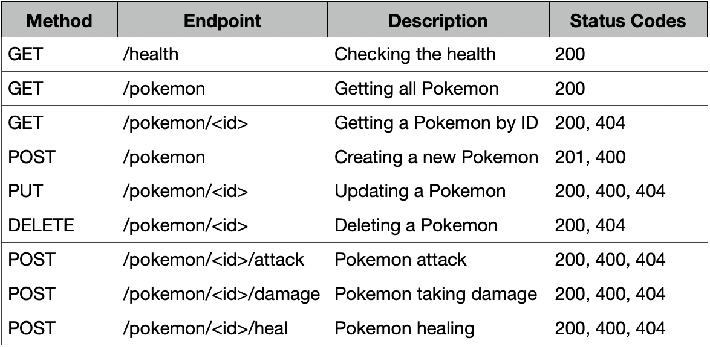
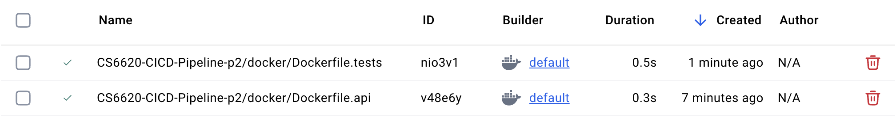
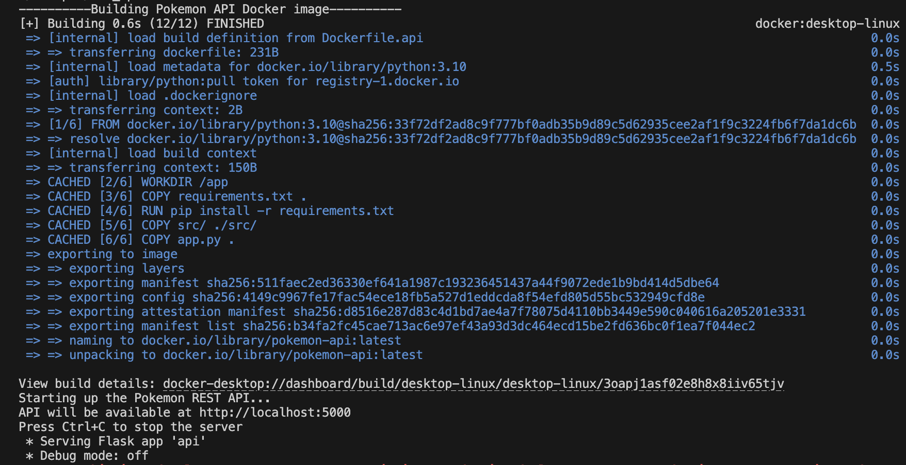
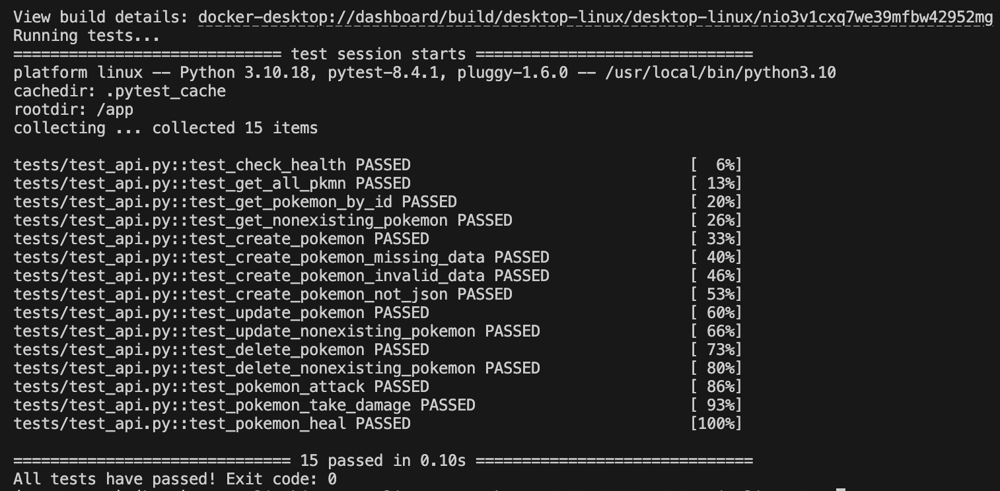

# CS6620-CICD-Pipeline-p2
This is a HW assignment for CS6620 (Cloud Computing) at the Roux Institute at Northeastern. It is a simple Pokemon-themed REST API (with GET, PUT, POST, and DELETE endpoints) built on top of the original Pokemon class from the Part 1 assignment found [here](https://github.com/charVANder/CS6620-CICD-Pipeline-p1). Demonstrates test-driven development, Docker containerization, and CI/CD workflows. There are two Dockerfiles (an API container that runs until manually stopped, and a Test container) along with two corresponding shell scripts found in the `docker` and `scripts` directories respectively. A GitHub Actions workflow runs tests automatically whenever code is pushed, a pull request is opened, or the workflow is triggered manually. Test workflow can be triggered manually by going to the `Actions` tab and clicking on the `Run Workflow` button under the Pokemon Tests workflow. You can view the configuration in `.github/workflows/main.yml`.

Shown below is an image of a few workflow runs (on push and upon manual triggering) as proof that the workflow is running correctly:
<p float="left", align="center">
  
</p>

...And here is a table of all the newly created API endpoints and status codes:
<p float="left", align="center">
  
</p>

...And here is an image of both Dockerfile builds on Docker Desktop
<p float="left", align="center">
  
</p>

## Running the API
Assuming that you have Docker running, here is how to run the REST API until manually stopped:
```bash
chmod +x scripts/run_api.sh
./scripts/run_api.sh
# press Ctrl+C to stop manually
```
The API will be available at http://localhost:5001 (Dockerfiles/scripts used port 5000, but I used port 5001 on my personal laptop to avoid personal conflicts with other services). Press `Ctrl+C` to stop the server.

If you go to http://localhost:5001/health, then you should see something like:
```
{"Note":"The Pokemon API is running","Status":"healthy"}
```

Shown below is an image of the API running successfully:
<p float="left", align="center">
  
</p>

## Running the Tests
Here is how you run the tests:
```bash
chmod +x scripts/run_tests.sh
./scripts/run_tests.sh
```
It exits with 0 if tests pass, and non-zero (1) if tests fail.

Shown below is an image of this working successfully:
<p float="left", align="center">
  
</p>

## Extra Testing
You can try out further tests with curl commands (examples shown below) once the API is running:
```bash
# Checking health (already shown previously)
curl http://localhost:5001/health

# Getting all Pokemon
curl http://localhost:5001/pokemon

# Creating a Pokemon
curl -X POST http://localhost:5001/pokemon \
  -H "Content-Type: application/json" \
  -d '{"name": "Squirtle", "level": 15, "type": "Water"}'

# Getting the new Pokemon by ID (ID should be 4 based on my sample data)
curl http://localhost:5001/pokemon/4

# Updating the new Pokemon
curl -X PUT http://localhost:5001/pokemon/4 \
  -H "Content-Type: application/json" \
  -d '{"name": "Wartortle", "level": 16}'

# Deleting the Pokemon
curl -X DELETE http://localhost:5001/pokemon/4
```

## Optional: Running Without Docker (not recommended)
Requires Python 3.10+
### Using `pip`:
```bash
pip install -r requirements.txt
python app.py # API at http://localhost:5000
PYTHONPATH=src pytest tests/ -v # run tests
```
### Using `conda`:
```bash
conda env create -f environment.yml
conda activate cicd_pipeline_p2_env
python app.py # API at http://localhost:5000
PYTHONPATH=src pytest tests/ -v # run tests
```

## References and AI Appendix
* HTTP response codes - https://developer.mozilla.org/en-US/docs/Web/HTTP/Reference/Status
* RESTful API testing - https://laerciosantanna.medium.com/mastering-restful-api-testing-with-pytest-56d22460a9c4
* Testing Flask apps - https://flask.palletsprojects.com/en/stable/testing/
* Running flask server under pytest - https://stackoverflow.com/questions/77676757/run-a-full-flask-server-under-pytest-to-handle-http-requests-on-a-given-port
* Asking Claude to fix a Docker Desktop (it was frozen) - https://claude.ai/share/f43454f6-87f2-40e7-a9ab-d0deeff13b6b
* Asking Claude for a REST APIs rundown - https://claude.ai/share/139d2226-5769-408b-bfa9-b8fd4e98b7de